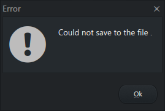

@import "report.less"

# report.css デモ文書
*所属・学年など*
*名前*

# 1. 概要
report.less は、Markdown Preview Enhanced のカスタムスタイルシートです
簡易なレポートを Markdown を書くだけで形成できます
文書の pdf 出力は puppeteer を想定しています

# 2. 機能

## 2.1. 全体
デフォルトだと文字がちょっとデカすぎるので小さめにします

## 2.1 文書タイトル
先頭の H1 とその直後の EM 要素はそれぞれ中央揃え・右揃えになります

## 2.2 画像

画像をいい感じに貼れます

*図1. FL Studio がバグったときに出てきたやつ*

## 2.3 表
表もいい感じになります

*表1. 家のパソコンの性能一覧(嘘)*

| 名前 | CPU | RAM 容量 | OS |
| -- | -- | -- | -- |
| Desktop | i5-12400 | 24 GB | Windows 11|
| Laptop | i5-1035G7 | 16 GB | Windows 11|
| Laptop Server #1 | i5-8245U | 8 GB | WIndows 10 / Ubuntu 24.10 |

